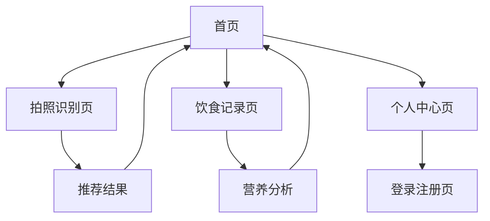

# 智能选择助手 - 产品需求文档

## 1. 产品概述

智能选择助手是一款专为选择困难症人群设计的AI决策辅助应用，通过智能分析用户的饮食偏好和营养需求，帮助用户轻松做出午餐选择。
- 解决选择困难症用户在面对众多餐饮选项时的决策焦虑问题，提供个性化的智能推荐服务。
- 目标市场价值：服务于日益增长的都市白领和学生群体，提升用餐决策效率和营养健康水平。

## 2. 核心功能

### 2.1 用户角色
| 角色 | 注册方式 | 核心权限 |
|------|----------|----------|
| 普通用户 | 邮箱注册（必须先注册才能使用） | 基础功能：拍照识别、饮食记录、查看推荐 |
| 会员用户 | 升级付费会员 | 高级功能：无限次识别、营养分析报告、个性化推荐 |

### 2.2 功能模块
智能选择助手包含以下主要页面：
1. **登录注册页**：用户认证、账户创建、密码重置
2. **首页**：智能推荐、快速操作、今日概览、用户欢迎
3. **拍照识别页**：AI图像识别、菜品分析、营养评估、推荐建议
4. **饮食记录页**：三餐记录、营养统计、历史查看、数据分析
5. **个人中心页**：用户资料、偏好设置、会员服务、统计数据

### 2.3 页面详情
| 页面名称 | 模块名称 | 功能描述 |
|----------|----------|----------|
| 登录注册页 | 用户认证 | 支持邮箱注册、登录验证、密码重置，集成Supabase认证系统 |
| 登录注册页 | 表单验证 | 实时验证邮箱格式、密码强度、确认密码匹配 |
| 首页 | 智能推荐 | 基于用户历史和偏好推荐午餐选择，显示推荐理由 |
| 首页 | 快速操作 | 一键进入拍照识别、饮食记录功能 |
| 首页 | 今日概览 | 显示当日卡路里摄入、健康评分、用餐次数 |
| 拍照识别页 | AI图像识别 | 集成GPT-4V或百度AI接口，真实识别菜品内容 |
| 拍照识别页 | 营养分析 | 分析识别菜品的营养成分、卡路里、健康评分 |
| 拍照识别页 | 智能推荐 | 基于识别结果提供个性化选择建议 |
| 饮食记录页 | 三餐记录 | 添加、编辑、删除早中晚餐记录 |
| 饮食记录页 | 营养统计 | 按日期统计卡路里、营养素摄入情况 |
| 个人中心页 | 用户资料 | 编辑个人信息、偏好设置、健康目标 |
| 个人中心页 | 会员服务 | 会员升级、功能权限管理、使用统计 |

## 3. 核心流程

**普通用户流程：**
用户打开应用 → 查看首页推荐 → 选择拍照识别功能 → 上传外卖截图 → 获得智能推荐 → 记录用餐照片 → 查看营养分析

**会员用户流程：**
用户登录 → 个性化首页推荐 → 使用高级分析功能 → 获得详细营养报告 → 设置个人偏好 → 享受无限次推荐服务

## 4. 用户界面设计
### 4.1 设计风格升级
**现代化设计理念：**
- **主色调**：渐变橙色 (#FF6B35 到 #F7931E)，传达温暖和食欲感
- **辅助色**：深蓝色 (#1E3A8A)、浅灰色 (#F8FAFC)、成功绿 (#10B981)
- **按钮风格**：圆角按钮 (rounded-xl)，支持悬停和点击动画效果
- **字体系统**：Inter字体，标题18-24px，正文14-16px，注重可读性
- **布局风格**：卡片式设计，毛玻璃效果，阴影层次分明
- **图标风格**：Lucide React线性图标，简洁现代
- **动画效果**：Framer Motion提供流畅的页面切换和交互反馈

### 4.2 页面设计概览
| 页面名称 | 模块名称 | UI元素设计 |
|----------|----------|------------|
| 登录注册页 | 认证表单 | 居中卡片布局，渐变背景，输入框带图标，实时验证提示 |
| 首页 | 智能推荐卡片 | 大卡片设计，渐变背景，菜品图片，营养标签，动画效果 |
| 首页 | 快速操作区 | 圆形按钮组，图标+文字，悬停放大效果 |
| 首页 | 今日概览 | 环形进度条，数据可视化，彩色标签 |
| 拍照识别页 | 上传区域 | 虚线边框，拖拽上传，预览缩略图，加载动画 |
| 拍照识别页 | 分析结果 | 卡片列表，置信度进度条，营养成分图表 |
| 饮食记录页 | 记录列表 | 时间轴设计，餐次图标，卡路里标签，滑动操作 |
| 饮食记录页 | 统计图表 | 柱状图/饼图，渐变色彩，交互式数据点 |
| 个人中心页 | 用户信息 | 头像上传，信息卡片，编辑按钮，会员徽章 |
| 个人中心页 | 设置选项 | 列表式布局，开关组件，分组标题 |

### 4.3 响应式设计
- **移动优先**：主要针对手机端优化，支持触摸交互
- **断点设计**：sm(640px)、md(768px)、lg(1024px)、xl(1280px)
- **交互优化**：支持手势操作、触摸反馈、适配安全区域
- **性能优化**：懒加载图片、虚拟滚动、动画性能优化