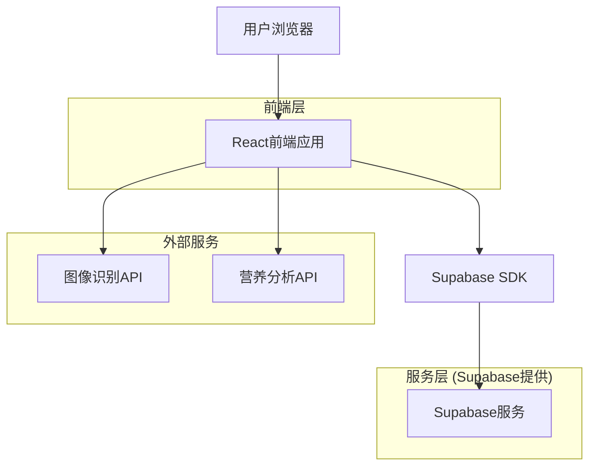
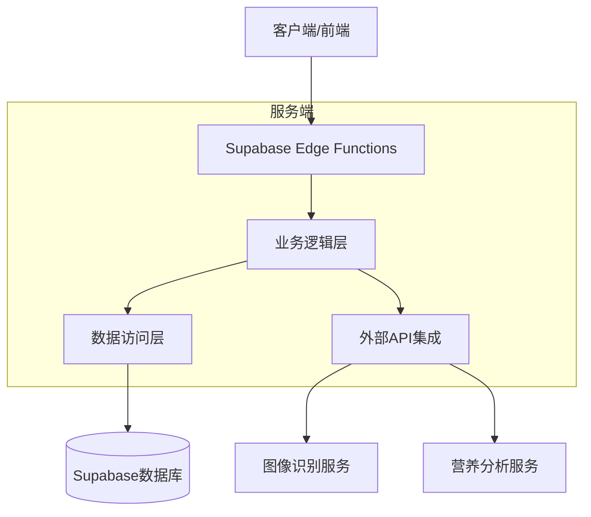
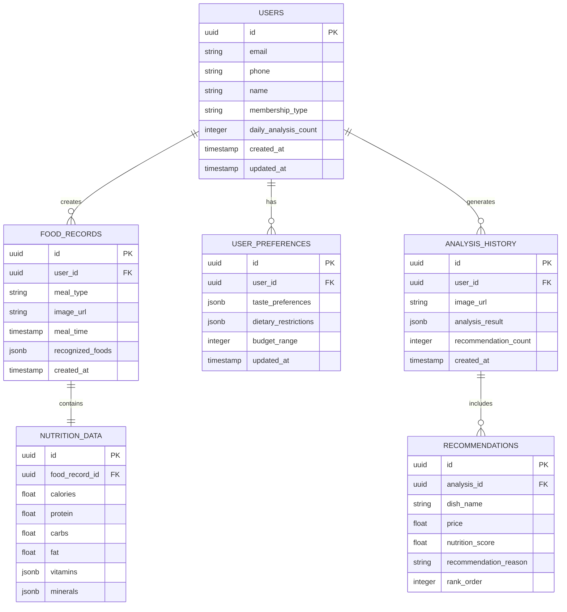

# 智能选择助手 - 技术架构文档

## 1. 架构设计



## 2. 技术描述

- 前端：React@18 + TypeScript + Tailwind CSS@3 + Vite + Framer Motion（动画效果）
- 后端：Supabase（用户认证 + 数据库）
- AI服务：OpenAI GPT-4V API（图像识别）或百度AI开放平台
- UI组件库：Headless UI + Lucide React Icons
- 状态管理：React Context + Hooks

## 3. 路由定义

| 路由 | 用途 |
|------|------|
| / | 首页，显示智能推荐和快速决策功能 |
| /photo-analysis | 拍照识别页面，上传外卖截图进行智能分析 |
| /food-record | 饮食记录页面，记录三餐并查看营养分析 |
| /profile | 个人中心页面，用户设置和历史记录 |
| /login | 登录页面，用户身份验证 |
| /register | 注册页面，新用户账户创建 |

## 4. API定义

### 4.1 Supabase认证API

用户注册
```typescript
supabase.auth.signUp({
  email: string,
  password: string,
  options: {
    data: {
      name: string
    }
  }
})
```

用户登录
```typescript
supabase.auth.signInWithPassword({
  email: string,
  password: string
})
```

### 4.2 AI图像识别API

GPT-4V图像分析
```
POST https://api.openai.com/v1/chat/completions
```

Request:
| 参数名 | 参数类型 | 是否必需 | 描述 |
|--------|----------|----------|------|
| model | string | true | "gpt-4-vision-preview" |
| messages | array | true | 包含图像和提示的消息数组 |
| max_tokens | number | true | 最大返回token数 |

百度AI菜品识别
```
POST https://aip.baidubce.com/rest/2.0/image-classify/v2/dish
```

Request:
| 参数名 | 参数类型 | 是否必需 | 描述 |
|--------|----------|----------|------|
| image | string | true | Base64编码的图片数据 |
| access_token | string | true | API访问令牌 |

### 4.3 数据类型定义

```typescript
interface User {
  id: string;
  email: string;
  name: string;
  membership_type: 'free' | 'premium';
  created_at: string;
}

interface FoodAnalysis {
  id: string;
  user_id: string;
  image_url: string;
  analysis_result: {
    dishes: Array<{
      name: string;
      confidence: number;
      calories: number;
      nutrition: {
        protein: number;
        carbs: number;
        fat: number;
      };
    }>;
    recommendation: string;
    health_score: number;
  };
  created_at: string;
}

interface FoodRecord {
  id: string;
  user_id: string;
  meal_type: 'breakfast' | 'lunch' | 'dinner';
  food_name: string;
  calories: number;
  nutrition: object;
  date: string;
  created_at: string;
}
```

## 5. 服务器架构图



## 6. 数据模型

### 6.1 数据模型定义



### 6.2 数据定义语言

**用户表 (users)**
```sql
-- 创建用户表
CREATE TABLE users (
    id UUID PRIMARY KEY DEFAULT gen_random_uuid(),
    email VARCHAR(255) UNIQUE NOT NULL,
    phone VARCHAR(20),
    name VARCHAR(100) NOT NULL,
    membership_type VARCHAR(20) DEFAULT 'free' CHECK (membership_type IN ('free', 'premium')),
    daily_analysis_count INTEGER DEFAULT 0,
    created_at TIMESTAMP WITH TIME ZONE DEFAULT NOW(),
    updated_at TIMESTAMP WITH TIME ZONE DEFAULT NOW()
);

-- 用户偏好表
CREATE TABLE user_preferences (
    id UUID PRIMARY KEY DEFAULT gen_random_uuid(),
    user_id UUID REFERENCES users(id) ON DELETE CASCADE,
    taste_preferences JSONB DEFAULT '{}',
    dietary_restrictions JSONB DEFAULT '[]',
    budget_range INTEGER DEFAULT 50,
    updated_at TIMESTAMP WITH TIME ZONE DEFAULT NOW()
);

-- 饮食记录表
CREATE TABLE food_records (
    id UUID PRIMARY KEY DEFAULT gen_random_uuid(),
    user_id UUID REFERENCES users(id) ON DELETE CASCADE,
    meal_type VARCHAR(20) NOT NULL CHECK (meal_type IN ('breakfast', 'lunch', 'dinner')),
    image_url TEXT NOT NULL,
    meal_time TIMESTAMP WITH TIME ZONE NOT NULL,
    recognized_foods JSONB DEFAULT '[]',
    created_at TIMESTAMP WITH TIME ZONE DEFAULT NOW()
);

-- 营养数据表
CREATE TABLE nutrition_data (
    id UUID PRIMARY KEY DEFAULT gen_random_uuid(),
    food_record_id UUID REFERENCES food_records(id) ON DELETE CASCADE,
    calories FLOAT DEFAULT 0,
    protein FLOAT DEFAULT 0,
    carbs FLOAT DEFAULT 0,
    fat FLOAT DEFAULT 0,
    vitamins JSONB DEFAULT '{}',
    minerals JSONB DEFAULT '{}'
);

-- 分析历史表
CREATE TABLE analysis_history (
    id UUID PRIMARY KEY DEFAULT gen_random_uuid(),
    user_id UUID REFERENCES users(id) ON DELETE CASCADE,
    image_url TEXT NOT NULL,
    analysis_result JSONB DEFAULT '{}',
    recommendation_count INTEGER DEFAULT 0,
    created_at TIMESTAMP WITH TIME ZONE DEFAULT NOW()
);

-- 推荐结果表
CREATE TABLE recommendations (
    id UUID PRIMARY KEY DEFAULT gen_random_uuid(),
    analysis_id UUID REFERENCES analysis_history(id) ON DELETE CASCADE,
    dish_name VARCHAR(200) NOT NULL,
    price FLOAT,
    nutrition_score FLOAT DEFAULT 0,
    recommendation_reason TEXT,
    rank_order INTEGER DEFAULT 0
);

-- 创建索引
CREATE INDEX idx_food_records_user_id ON food_records(user_id);
CREATE INDEX idx_food_records_meal_time ON food_records(meal_time DESC);
CREATE INDEX idx_analysis_history_user_id ON analysis_history(user_id);
CREATE INDEX idx_analysis_history_created_at ON analysis_history(created_at DESC);
CREATE INDEX idx_recommendations_analysis_id ON recommendations(analysis_id);

-- 设置RLS权限
ALTER TABLE users ENABLE ROW LEVEL SECURITY;
ALTER TABLE user_preferences ENABLE ROW LEVEL SECURITY;
ALTER TABLE food_records ENABLE ROW LEVEL SECURITY;
ALTER TABLE nutrition_data ENABLE ROW LEVEL SECURITY;
ALTER TABLE analysis_history ENABLE ROW LEVEL SECURITY;
ALTER TABLE recommendations ENABLE ROW LEVEL SECURITY;

-- 基础权限设置
GRANT SELECT ON users TO anon;
GRANT ALL PRIVILEGES ON users TO authenticated;
GRANT ALL PRIVILEGES ON user_preferences TO authenticated;
GRANT ALL PRIVILEGES ON food_records TO authenticated;
GRANT ALL PRIVILEGES ON nutrition_data TO authenticated;
GRANT ALL PRIVILEGES ON analysis_history TO authenticated;
GRANT ALL PRIVILEGES ON recommendations TO authenticated;

-- 初始化数据
INSERT INTO users (email, name, membership_type) VALUES 
('demo@example.com', '演示用户', 'premium'),
('test@example.com', '测试用户', 'free');
```